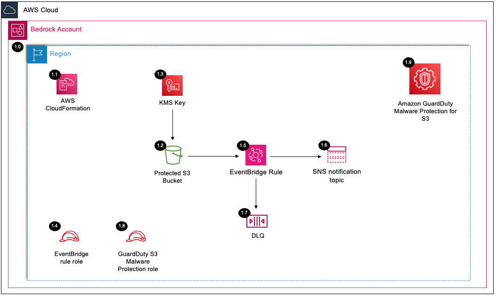

# SRA Bedrock Guardrails Solution

## Table of Contents
- [Introduction](#introduction)
- [Deployed Resource Details](#deployed-resource-details)
- [Implementation Instructions](#implementation-instructions)
- [References](#references)

---

## Introduction

This solution deploys Amazon GuardDuty Malware Protection for S3 using AWS CloudFormation. It creates protection plan to enable automated scanning of new objects in S3 buckets for malware and sends notifications of scan results. GuardDuty Malware Protection for S3 can detect malicious content in files before they are processed or used by other systems, enhancing the security of data stored in S3.
A key use case for this solution is in the preparation of knowledge bases for Retrieval Augmented Generation (RAG) with Amazon Bedrock. The malware protection capabilities help enhance the security controls for documents and files used in Amazon Bedrock knowledge base construction, contributing to the overall security posture of AI-powered applications.

### Features

- Creates or uses existing S3 bucket for malware protection
- Creates a new KMS key for encrypting the S3 bucket (when creating a new bucket)
- Creates a KMS key alias for easy management
- Provides an option to enable S3 server access logging during bucket creation
- Configures GuardDuty Malware Protection Plan
- Sets up EventBridge rules for scan result notifications
- Implements SNS notifications for alerts
- Includes DLQ for failed event processing
- Configures necessary IAM roles and permissions


---

## Deployed Resource Details



This section provides a detailed explanation of the resources shown in the architecture diagram:

### 1.0 Bedrock Account<!-- omit in toc -->

#### 1.1 AWS CloudFormation<!-- omit in toc -->
- Used to define and deploy resources in the solution.

#### 1.2  Protected S3 Bucket<!-- omit in toc -->
- GuardDuty scans each uploaded object.
- Can be newly created or an existing bucket.

#### 1.3 KMS Key<!-- omit in toc -->
- Encrypts objects in the S3 bucket when creating a new bucket.

#### 1.4 EventBridge Rule Role<!-- omit in toc -->
- IAM role for EventBridge rule execution.

#### 1.5 EventBridge Rule<!-- omit in toc -->
- Triggers notifications based on GuardDuty Malware Protection scan results.

#### 1.6 SNS Notification Topic<!-- omit in toc -->
- Sends alerts about malware scan results.

#### 1.7 Dead-Letter Queue (DLQ)<!-- omit in toc -->
- Handles failed event processing from EventBridge.

#### 1.8 GuardDuty S3 Malware Protection Role<!-- omit in toc -->
- IAM role for GuardDuty to perform malware scans on S3 objects.

#### 1.9 Amazon GuardDuty Malware Protection for S3<!-- omit in toc -->
- Scans new S3 objects for malicious content.
- Enables tagging for scanned S3 objects.

---

## Implementation Instructions

### Prerequisites<!-- omit in toc -->

- CloudFormation template deployment permissions in the target AWS account

#### Notes:
- This solution operates independently and does not require the deployment of the [SRA Prerequisites Solution](../../common/common_prerequisites).

### Solution Deployment<!-- omit in toc -->

You can deploy this solution using the AWS Console or AWS CLI.

### Deploying via AWS Management Console<!-- omit in toc -->
1. In the `target account`, open the [CloudFormation Console](https://console.aws.amazon.com/cloudformation).
2. Create a new stack by uploading the `sra-guardduty-s3-protection-plan-main.yaml` template located in the `./templates` directory.
3. Provide the required parameters to configure GuardDuty Malware Protection for S3.
4. Review and confirm the stack creation.

### Deploying via AWS CLI
1. Run the following command to deploy the stack:
#### Notes:
- Update parameter values with your specific settings. 
- When deploying with an existing bucket, add the following parameters to your CloudFormation deployment command:
```bash
ParameterKey=pExistingBucketName,ParameterValue="bucket-name" \
ParameterKey=pExistingBucketKmsKey,ParameterValue="kms-key-arn"
```
- This example assumes the CloudFormation template file is saved in the templates directory. Adjust the --template-body path if necessary.
- Ensure the --capabilities CAPABILITY_NAMED_IAM flag is included to allow CloudFormation to create the necessary IAM resources.

```bash
aws cloudformation create-stack \
    --stack-name SraGuardDutyMalwareProtectionForS3 \
    --template-body file://aws_sra_examples/solutions/genai/sra_guardduty_malware_protection_for_s3/templates/sra-guardduty-malware-protection-for-s3-main.yaml \
    --region us-east-2 \
    --parameters \
        ParameterKey=pCreateNewBucket,ParameterValue="true" \
        ParameterKey=pUseExistingBucket,ParameterValue="false" \
        ParameterKey=pSRASolutionName,ParameterValue=sra-guardduty-malware-protection-for-s3 \
        ParameterKey=pKmsKeyAlias,ParameterValue=sra-guardduty-malware-protection-for-s3-key \
        ParameterKey=pS3MalwareProtectedBucketNamePrefix,ParameterValue=sra-protected-bucket \
        ParameterKey=pEventRuleRoleName,ParameterValue=sra-guardduty-malware-protection-for-s3-events \
        ParameterKey=pSRAAlarmEmail,ParameterValue=your-email@example.com \
    --capabilities CAPABILITY_NAMED_IAM
```

2. Monitor the stack creation progress in the AWS CloudFormation Console or via CLI commands.

### Post-Deployment
Once the stack is deployed successfully:
- Verify Resource Creation
```bash
aws guardduty list-malware-protection-plans
```

- An email will be sent to confirm the SNS topic subscription. Click the confirmation link to receive malware detection alerts.
- To verify the alerting functionality of GuardDuty Malware Protection for S3 solution, the European Institute for Computer Anti-Virus Research (EICAR) test file can be used. This standardized test file triggers antivirus detection without being actual malware. The EICAR test file should be uploaded to the protected S3 bucket. After upload, verify that the object has been tagged with the scan results, and confirm that an email alert about the detected threat was received. This process provides a safe way to validate that the malware protection setup is functioning as expected.

---

## References
- [AWS SRA Generative AI Deep-Dive](https://docs.aws.amazon.com/prescriptive-guidance/latest/security-reference-architecture/gen-ai-sra.html)
- [Capability 2. Providing secure access, usage, and implementation to generative AI RAG techniques](https://docs.aws.amazon.com/prescriptive-guidance/latest/security-reference-architecture/gen-ai-rag.html)
- [GuardDuty Malware Protection for S3](https://docs.aws.amazon.com/guardduty/latest/ug/gdu-malware-protection-s3.html)
- [AWS CloudFormation Documentation](https://docs.aws.amazon.com/cloudformation/index.html)
- [AWS KMS](https://docs.aws.amazon.com/kms/latest/developerguide/overview.html)

