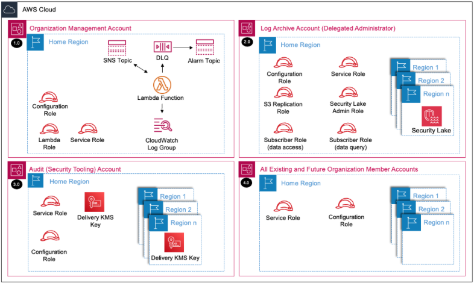

# Security Lake Organization<!-- omit in toc -->

Copyright Amazon.com, Inc. or its affiliates. All Rights Reserved. SPDX-License-Identifier: CC-BY-SA-4.0

## Table of Contents

- [Table of Contents](#table-of-contents)
- [Introduction](#introduction)
- [Deployed Resource Details](#deployed-resource-details)
- [Implementation Instructions](#implementation-instructions)
- [References](#references)

---

## Introduction

AWS SRA Security Lake solution will automate enabling Amazon Security Lake by delegating administration to a Log Archive account and configuring Amazon Security Lake for all existing and future AWS Organization accounts.

**Key solution features:**

- Delegates  Amazon Security Lake administration to Log Archive account is Security OU.
- Assumes a role in the delegated administrator account to create required IAM roles and data lakes.
- Adds all existing accounts including the management account as members.
- Configures log sources

---

## Deployed Resource Details



### 1.0 Organization Management Account<!-- omit in toc -->


---

## Implementation Instructions

### Prerequisites<!-- omit in toc -->

1. [Download and Stage the SRA Solutions](../../../docs/DOWNLOAD-AND-STAGE-SOLUTIONS.md). **Note:** This only needs to be done once for all the solutions.
2. Verify that the [SRA Prerequisites Solution](../../common/common_prerequisites/) has been deployed.

### Solution Deployment<!-- omit in toc -->

Choose a Deployment Method:

- [AWS CloudFormation](#aws-cloudformation)
- [Customizations for AWS Control Tower](../../../docs/CFCT-DEPLOYMENT-INSTRUCTIONS.md)

#### AWS CloudFormation<!-- omit in toc -->

In the `management account (home region)`, launch the [sra-security-lake-org-main-ssm.yaml](templates/sra-security-lake-org-main-ssm.yaml) template. This uses an approach where some of the CloudFormation parameters are populated from SSM parameters created by the [SRA Prerequisites Solution](../../common/common_prerequisites/).

  ```bash
  aws cloudformation deploy --template-file $HOME/aws-sra-examples/aws_sra_examples/solutions/security-lake/security-lake/templates/sra-security-lake-org-main-ssm.yaml --stack-name sra-security-lake-org-main-ssm --capabilities CAPABILITY_NAMED_IAM --parameter-overrides pGuarddutyEnabledForMoreThan48Hours=<TRUE_OR_FALSE>
  ```

##### Important<!-- omit in toc -->

Pay close attention to the `--parameter-overrides` argument.  For launching of the AWS Cloudformation stack using one of the commands in the options above to be successful, Amazon GuardDuty must have been enabled for at least 48 hours, **and** the `pGuarddutyEnabledForMoreThan48Hours` parameter in the `--parameter-overrides` argument must be set to `true`.  If it is set to `false` the stack launch will fail and provide an error.

#### Verify Solution Deployment<!-- omit in toc -->


#### Solution Update Instructions<!-- omit in toc -->

1. [Download and Stage the SRA Solutions](../../../docs/DOWNLOAD-AND-STAGE-SOLUTIONS.md). **Note:** Get the latest code and run the staging script.
2. Update the existing CloudFormation Stack or CFCT configuration. **Note:** Make sure to update the `SRA Solution Version` parameter and any new added parameters.

#### Solution Delete Instructions<!-- omit in toc -->

1. In the `management account (home region)`, delete the AWS CloudFormation **Stack** (`sra-security-lake-org-main-ssm`).
2. In the `management account (home region)`, verify that the Lambda function processing is complete by confirming no more CloudWatch logs are generated.
3. In the `management account (home region)`, delete the AWS CloudWatch **Log Group** (e.g. /aws/lambda/<solution_name>) for the Lambda function deployed.

#### Instructions to Manually Run the Lambda Function<!-- omit in toc -->

1. In the `management account (home region)`, navigate to the AWS Lambda Functions page.
2. Select the `checkbox` next to the Lambda Function and select `Test` from the `Actions` menu.
3. Scroll down to view the `Test event`.
4. Click the `Test` button to trigger the Lambda Function with the default values.
5. Verify that the updates were successful within the expected account(s).

---

## References

- [Managing AWS SDKs in Lambda Functions](https://docs.aws.amazon.com/lambda/latest/operatorguide/sdks-functions.html)
- [Lambda runtimes](https://docs.aws.amazon.com/lambda/latest/dg/lambda-runtimes.html)
- [Python Boto3 SDK changelog](https://github.com/boto/boto3/blob/develop/CHANGELOG.rst)
